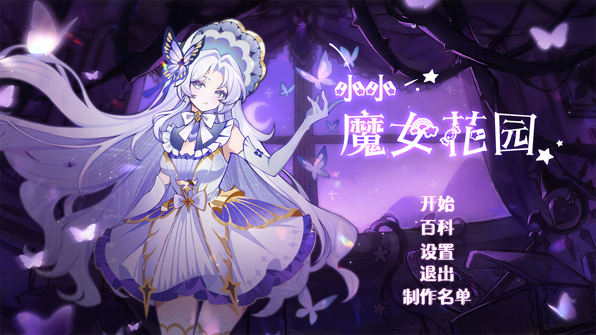
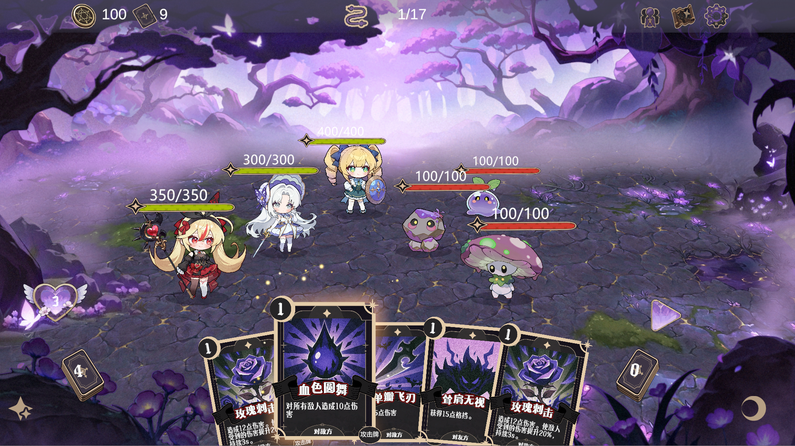

# LittleWitchGarden

小小魔女花园是一款Roguelike卡牌-自走棋游戏，由清华大学交叉信息研究院助理教授[**贺天行**](https://cloudygoose.github.io/)领导监督制作。

**项目领导人&制作总监：** 贺天行  
**策划：** Lanlan  
**程序：** Henius  
**美术：** Peipei，立喵，LiYing，青菜  
**动画：** Henius，Kangda  

## 游戏背景

一切，始于那个瞬间。
黑魔女尤娜的诅咒无声降临，
花园在凋零中褪去色彩。
为了守护记忆里的那片净土，
你以卡牌编织命运，
与三位魔女一同踏上征程——
穿越迷雾与荒墟，唤回失落的色彩。

**制作引擎：** Unity

## 游玩方法：
本仓库使用LFS上传，请前往[Release](https://github.com/MajestyHenius/LittleWitchGarden/releases/tag/v1.0.0) 下载0323.zip，解压后运行exe

游戏沿用Roguelike要素，中途退出游戏，正在进行的战斗不会被保存。但已取得的全局卡牌解锁进度将会保留。

## 版权信息：

此仓库仅用于分发目的而托管游戏构建。游戏资产和源代码是**非**开源的。
游戏代码和美术资产归制作组所有。
使用的音乐来自于公开素材库(CC BY 4.0)：[PeriTune](https://peritune.com/) 

---

## English

Little Witch Garden is a card-based auto-battler game, directed and supervised by [**Tianxing He**](https://cloudygoose.github.io/), Assistant Professor at the Institute for Interdisciplinary Information Sciences (IIIS), Tsinghua University.

**Project Lead & Director:** Tianxing He  
**Game Design:** Lanlan  
**Game Develop:** Henius  
**Art:** Peipei, Limiao, LiYing, Qingcai  
**Animation:** Henius, Kangda  

### Story

It all began in a single moment.
The curse of the dark witch Yuna descended in silence,
and the garden withered, losing all its color.
To protect the sanctuary that lives on in memory,
you weave fate through cards
and set out on a journey alongside three witches——
through mist and ruins, to reclaim the lost colors.

**Engine:** Unity

---

## Download

Go to the [Releases](../../releases) page to download the latest version. v1.0.0.

**Note**: This repo uses **LFS** to upload files, directly download git and run .exe may not work due to loss of game resources. Please go to [Release](https://github.com/MajestyHenius/LittleWitchGarden/releases/tag/v1.0.0) to download "0323.zip" and unzip it to play.

### System Requirements

- **OS:** Windows 10 or later
- **Storage:** 2 GB (fill in actual size)

## How to Play

Download the `.zip` from Releases, extract it, and run `LittleWitchGarden.exe`.

## Feedback & Bug Reports

If you encounter any issues or have suggestions, please open an [Issue](../../issues).

## License

This repository hosts game builds for distribution purposes only. The game assets and source code are **not** open-source. All rights reserved.
The BGMs used in this game comes from the open library (following CC BY 4.0): [PeriTune]( https://peritune.com/)
